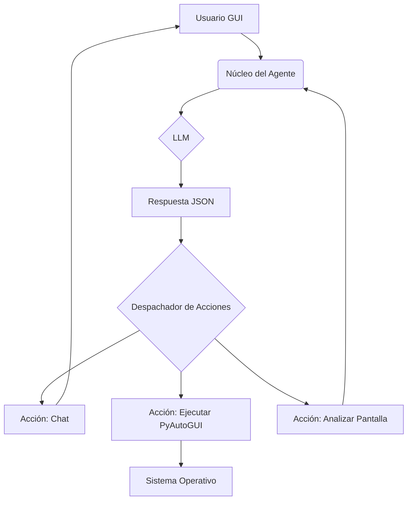

# Plan de Desarrollo: InteractIA v2.0 - Agente de Escritorio Universal

## 1. Visión General

El objetivo de la versión 2.0 es refactorizar `InteractIA` para transformarlo de un sistema basado en habilidades predefinidas a un **Agente de Propósito General**. Este nuevo agente operará directamente sobre el entorno de escritorio del usuario (GUI) utilizando la librería `pyautogui`. La toma de decisiones será centralizada en un único modelo de lenguaje (LLM), que generará dinámicamente el código de automatización necesario para cumplir con las solicitudes del usuario.

La arquitectura se simplifica radicalmente, siguiendo un flujo de control claro y potente.

---

## 2. Arquitectura y Flujo de Datos

El flujo de operación será el siguiente:

1.  **Entrada de Usuario (GUI):** El usuario envía un mensaje (ej: "Abre el bloc de notas y escribe hola mundo") a través de la interfaz gráfica.
2.  **Núcleo del Agente (`agente.py`):**
    *   Recibe el mensaje.
    *   Recopila contexto relevante: historial del chat, y opcionalmente, análisis de la pantalla actual o datos de la "base de conocimiento".
    *   Construye un **"Prompt Maestro"** y lo envía al LLM.
3.  **Decisión del LLM:** El LLM procesa el prompt y decide la acción a tomar. Su respuesta debe ser un objeto JSON estructurado.
4.  **Despachador de Acciones (`dispatcher.py`):** El núcleo del agente parsea el JSON y ejecuta la función correspondiente a la acción solicitada.
5.  **Ejecución de la Acción:**
    *   **Chat:** Se envía una respuesta de texto al usuario.
    *   **Automatización:** Se ejecuta un fragmento de código `pyautogui`.
    *   **Análisis:** Se captura la pantalla para un futuro ciclo de decisión.
6.  **Bucle:** El ciclo se repite.

---

## 3. Fases de Desarrollo

### Fase 1: El Núcleo del Agente y el Prompt Maestro [Completada ✅]

**Componentes:** `agente.py`, `dispatcher.py`, `ejecutor.py`

### Fase 2: Módulos de Acción (Las "Herramientas") [Completada ✅]

1.  **Módulo de Ejecución (`ejecutor.py`):**
    *   **Estado:** Implementación básica completada ✅

2.  **Módulo de Visión (`vision.py`):**
    *   **Estado:** Completado ✅
    *   **Descripción:** Se ha implementado la función `capture_and_analyze_screen()` que captura la pantalla y usa un modelo multimodal para obtener una descripción textual de la UI.

3.  **Módulo de Memoria y Conocimiento (`memoria.py`):**
    *   **Estado:** Completado ✅
    *   **Descripción:** Se ha implementado tanto el historial de chat como la base de conocimiento para la documentación de `pyautogui` con búsqueda semántica.

### Fase 3: Limpieza de Código Obsoleto [Completada ✅]

*   **Estado:** Completado ✅
*   **Descripción:** Se han eliminado los componentes de la v1 (sistema de habilidades).

---

## 4. Riesgos y Mitigaciones

1.  **Riesgo Principal: Seguridad en la Ejecución de Código.**
    *   **Mitigación:** Logging, whitelisting de módulos, sistema de "dry-run".
2.  **Riesgo: Alucinaciones del LLM.**
    *   **Mitigación:** Manejo de errores robusto y base de conocimiento (`pyautogui`) para autocorrección.
